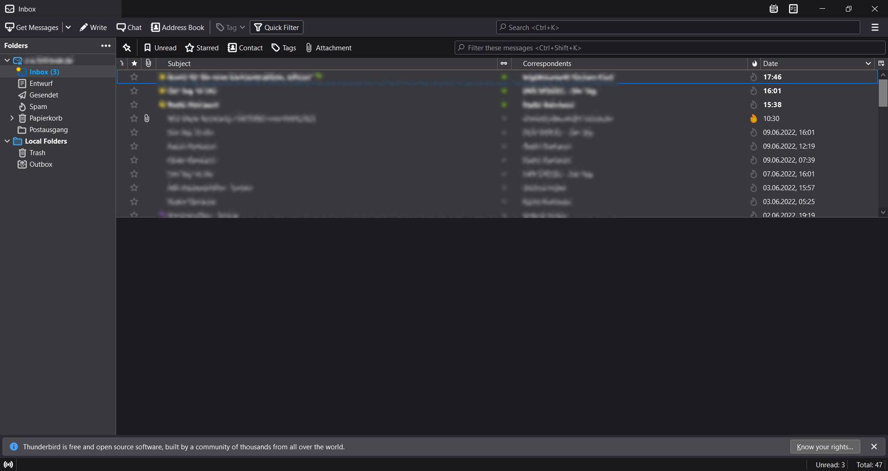
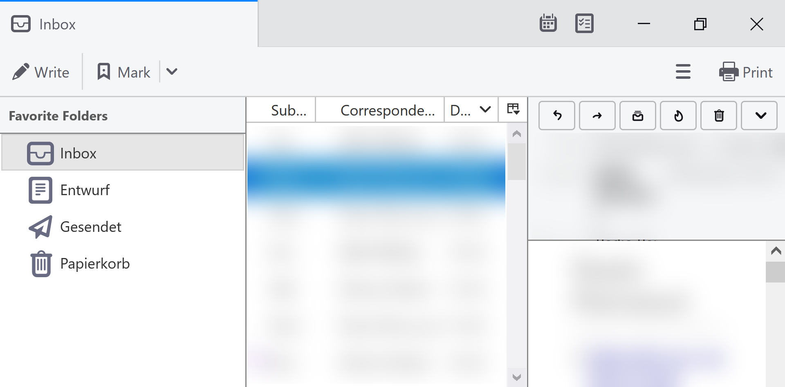

# SimpleThunderbirdLayout

## Description
For different reasons people are looking for a simplified **mail client that is reduced to the main mail tasks: sending and receiving mails**. This repository provides options to reduce and focus the manifold functions of the famous and free-to-use Thunderbird client to the core functions.

### Purpose
**Visually or mentally impaired persons as well as seniors or PC beginners of any age** may have difficulties to operate traditional mail clients that come with a richness of possibilities and, thus, have a overloaded and complex interface. 

### Why
Due to private reasons I was looking for a simplistic mail client that is reduced to the core functions expected from a mail client: sending and receiving mails. However, I was not able to find a suitable program that fulfils this requirement, and also provides the possibility to style the layout, labels and buttons in a better readable and accessible way. The existing web interfaces of some providers also change from time to time what would require their users to adopt their leaned routines.  
Because of that I decided to adapt the famous [Thunderbird Mail Client](https://www.thunderbird.net/) to the required needs. I am happy to share my solution with you as I guess it might also be helpful to many others. Feel free to contribute and please don't hesitate to send me your feedback and suggestions!

### Result
| Main Window         |  |
|-------------------|------------|
| Default View |  |
| After Styling |  |

| Compose Window         |  |
|-------------------|------------|
| Default View |  |
| After Styling |  |

## How To Set Up:
### Installation:
The first step is to download the free-to-use mail client Thunderbird. If required, please get assistance by someone who can help you.

There are two installation variants of Thunderbird:
- Ordinary Installer: Thunderbird can be installed like other software to the machine where it shall be used. This means also the configurations required for the simple layout have to be done at the desired machine. The executable of this installer variant can be downloaded in many localizations for Windows, Linux and MacOS from [thunderbird.net](https://www.thunderbird.net/en-US/thunderbird/all/).
- Portable: There is also a portable variant of Thunderbird. "Portable" means that Thunderbird is set up in a special way, which makes no changes to the machine it is currently ran from and also does not require any machine-related dependencies. Instead all data, settings and the program itself are stored to a single folder chosen during the setup process. That allows a third-person to follow the steps of this tutorial, get everything ready and then just move the created Thunderbird folder to the machine of the person wanting to run it. There is a [official version in different localizations for Windows co-published by Mozilla at portableapps.net](https://portableapps.com/apps/internet/thunderbird_portable#localizations).

Choose the variant you want to follow, download the setup file in the desired locale and execute it. Follow the steps to complete with the default configuration and start Thunderbird.

### Increase the overall scaling of Thunderbird
To increase the overall size of the Thunderbird layout there is a possibility to scale the interface.  
If you are interested in having a larger sized interface from the beginning follow the steps. But you could also skip them for the moment and apply the scaling later.
- Go to the **Preferences**: Press the **"Alt" key once** to make the menu bar appear at the top. Then click **Tools** and then **Preferences**
- In the left column the **General** section is now highlighted. In the main panel scroll to the bottom and click on **Config Editor**
- At the top of the Config Editor there is a search bar, where you can now search for the preference `layout.css.devPixelsPerPx`. After entering the text, in the panel below a row will appear with the preference name and next to it a float value (most probably -1.0). You can change the value from -1.0 to an arbitrary float value bigger than 1.0. Usually a value between 1.0 or 3.0 is most helpful. Please take care to use a dot instead of a comma for the float, if using a comma nothing will change. Press "Enter" to submit your input. This will immediately scale the interface.
- If you are not satisfied with the scaling just try several different values to adapt the scaling factor to your personal requirements and monitor screen size. 

https://user-images.githubusercontent.com/5712180/172167995-3d85e1a0-66e6-4f72-904a-74063cf0b53c.mov

> Due to the scaling factor it might happen that the mouse scrolling is neither smooth nor fine enough and jumps over lines so you cannot read everything. This problem can be fixed by reducing the scroll speed in the configurations by decreasing the value of the `mousewheel.default.delta_multiplier_y` option.

### Main Window Configuration
When starting Thunderbird without having a mail account setup yet, you are presented a wizard to configure your mail account. Follow the steps required.  

  

> :warning: **Please be aware that some mail providers require you to enable IMAP/POP in in the settings of their web ui at first.**
 
If everything is configured successfully, you should see a screen like this:  

For some mail providers Thunderbird also shows an option to connect with the address book stored online at your email provider. If you are interested you can use this option. As an alternative you could also import your contacts from another source (please look it up by yourself).
Finally scroll to the bottom and click on "Finish".

### Adapt view of Thunderbird
There are diverse ways to customize the view of Thunderbird:

#### Theme:
Thunderbird allows to choose from different color schemes. By default the Thunderbird colors will try to apply your systems style & colors. If you want to set a certain Theme (e.g. light or dark) specifically you can do that.
- Go to the **Add-ons and Themes**: Press the **"Alt" key once** to make the menu bar appear at the top. Then click **Tools** and then **Add-ons and Themes**
- On the left click on **Themes**
- Now you can see the currently enabled and multiple disabled themes. If you want to use one of the currently disabled themes just click on the button "Enable" next to it to apply it immediately.

  

#### Inbox-Layout
Thunderbird offers three different layouts for its main window. This will mostly affect the positioning and room given to the email view panel. Select the layout depending on your screen size and personal preferences so it is most comfortable for you.
- Press the **"Alt" key once** to make the menu bar appear at the top.
- Now click **View**, next **Layout** and then choose one of the options **Classic View**, **Wide View** or **Vertical View**.

If you use a really large scaling for a big font, showing the folder pane next to the email list and the email view might lead to a result where there is too less space for each of the elements and the view is crowded.

  

In such a case you might also want to switch off the email view within the main window. Then you will only see the folder pane next to the list of emails. To view a mail then, you can just double click on a mail.  

- Press the **"Alt" key once** to make the menu bar appear at the top.
- Now click **View**, next **Layout** and then deselect **Message Pane**.

> Depending on your settings (see "Open messages in" in the adapt settings section) double clicking on a mail will open a new tab or window.

#### Density
To increase the clarity, you can stretch the layout to get more space between individual items.
- Press the **"Alt" key once** to make the menu bar appear at the top.
- Now click **View**, next **Density** and  select **Touch** for the largest spacing.
> You can also set this option in the configuration with the setting `mail.uidensity` = 2

#### Remove unused view elements 

Thunderbird has a lot of nice features, toolsbars, options, etc. However, a lot of them are just additional and not required to be used or could just be removed for simplicity and clarity.

##### Limiting the Displayed Folders
In the folder panel at the left it shows lots of folders which might not be relevant to everybody. Thus, it might be helpful to reduce the displayed folders to the ones actually needed.
- This can be done, by selecting the wanted folders as favorites (via right-click menu).
-Then by clicking on the three dots in the right upper corner of that panel, the "Favorite Folders" option can be selected and the "All folders" option can be deselected to only show the previous marked favorite folders.
  > :warning: **The three dots are part of the Folder Pane Toolbar. Possibly it is deactivated. The next subchapter below describes how to disable the toolbar and you can activate it at the same place.**   
- Also there is a possibility called "Compact View" which can be enabled additionally. It will flatten the hierarchy of the displayed folders and will show them at one level. 

	  
	&nbsp;&nbsp;&nbsp;&nbsp;&nbsp;&nbsp;&nbsp;&nbsp;

	&nbsp;&nbsp;&nbsp;&nbsp;&nbsp;&nbsp;&nbsp;&nbsp;

	&nbsp;&nbsp;&nbsp;&nbsp;&nbsp;&nbsp;&nbsp;&nbsp;

##### Hiding irrelevant toolbars
There are 5 different toolbars for Thunderbird's main window. However only the Mail Toolbar is really required and contains the Compose as well as Search button.  
The Menu Bar gives quicker access to the main menu that can be shown by pressing the Alt key once.  
The Folder Pane Toolbar allows to change the folders type shown in the folder panel.  
The Quick Filter Bar shows a bar to allow quick filtering of mails.  
The status bar show a bar at the bottom of the window with the online/offline state and the count of currently read/unread mails.  

- To hide any of these toolbars press the **"Alt" key once** to make the menu bar appear at the top. Now click **View**, **Toolbars** and deselect the desired toolbar.
> Recommendation: If not needed, I recommend to disable all toolbars except the Mail Toolbar.

##### Removing unwanted buttons from the Mail Toolbar
By default the Mail Toolbar comes with a lot of buttons, of which some might be not required. 

	  

- You can **right-click on the Mail Toolbar** and then click **Customize**.
- A new popup appears where you can use drag-and-drop to remove all the unwanted buttons to or add the ones that you require

> I just left the Write, Mark and Print button. Also the search bar might be quite helpful. I even removed the address book button, as I will show how to add the address book as sidebar to the compose window.

##### Removing unwanted columns from the mail list
In the mail list panel there is a row for each mail. The columns are user defined and you can choose from a large set of possibilities. To have this list in a clear and puristic view, show only the required columns and hide every column that is not needed.

	  

- To the right of the column titles, directly above the scrollbar there is one icon. Click on it. 
- A popup appears that allows to select the columns that shall be shown. 

> I just left the Subjects (which cannot be deselected), the correspondents and the time. 

### Mail Compose Window Configuration
The same way the main window can be configured there are also options to style the compose window. To change the layout, you have to open the compose window (by clicking the "write" button at the top left of the main window). 

#### Hiding irrelevant toolbars
There are 4 different toolbars for the compose window. However only the Composition Toolbar is really required and contains the send button.  
The Menu Bar gives quicker access to the main menu that can be shown by pressing the Alt key once.  
The Formatting Bar allows to format the written email text (e.g. bold, underlined, add bulleted or numbered lists, ...) 
The Status Bar show a bar at the bottom of the window with the current language that is used for the 	spelling check.

- To hide any of these toolbars press the **"Alt" key once** to make the menu bar appear at the top. Now click **View**, **Toolbars** and deselect the desired toolbar.
> Recommendation: If not needed, I recommend to disable all toolbars except the Composition Toolbar.

#### Removing unwanted buttons from the Composition Toolbar
By default the Composition Toolbar comes with a lot of buttons, of which some might be not required. 

	  

- You can **right-click on the Composition Toolbar** and then click **Customize**.
- A new popup appears where you can use drag-and-drop to remove all the unwanted buttons to or add the ones that you require

> I just left the Send, Save and Attach button.

#### Show contacts in sidebar
By default, when typing into the "To", "CC" or "BCC" field, you will see contact suggestions which you can select by keys or mouse. However, it might come in handy to view a list of all contacts in a sidebar.
- To show the contacts sidebar, press the **"Alt" key once** to make the menu bar appear at the top.
- Now click **View** and then **Contacts Sidebar** (As an alternative you could also toggle the sidebar by pressing F9)

### Adapt settings of Thunderbird
Thunderbird allows to change a wide range of options. In the following you can find a few recommendations that only address the potential needs of accessibility and simplicity. Please follow them depending on your needs and way of work.
- Go to the **Preferences**: Press the **"Alt" key once** to make the menu bar appear at the top. Then click **Tools** and then **Preferences**
- On the left select the desired section.

#### Section: General
- General
  - Thunderbird Start Page
    - When Thunderbird launches, show the Start Page in the message area
      > Recommendation: Deselect the checkbox if you don't want to see the Thunderbird default page. Then the message view will be just empty before you click on a mail. 
  - System Integration:
    -  Always check to see if Thunderbird is the default mail client on startup
       > Recommendation: Leave this checkbox unset. This will prevent the user from being shown a message if Thunderbird is not the default mail handler but will let him continue with the desired use. However, set Thunderbird as default mail handler in your operating systems settings.
- Language & Appearance
  - Fonts & Colours
    - Default Font
	  > Recommendation: Change the font size of this setting and all the sizes under the "Advanced" button, as well as the minimal font size to the same value (adapt it to the available technic and your needs)
	- Advanced
	  - Allow messages to use other fonts
	    > Recommendation: Deselect this option to prevent HTML mails to use arbitrary fonts that are potentially hard to read
- Incoming Mails:
  - When new messages arrive
    - Change preferences for the app icon
      > Recommendation: Click on "App Icon Options" and disable the checkbox for "Show badge icon", as the badge symbols are very small and possible hard to recognize. Confirm with "OK"
    - Show an alert
      > Recommendation: To completely prevent a user from being interrupted from its actual work uncheck this setting. If you still want to receive alerts, click on "Customise" and disable the checkbox for "Message Preview Text". Since mail texts are usually longer than what can be displayed in a small notification window, it is unnecessary to display the beginning of the text in the notification window. This will also focus the notification to the important aspects of subject and sender. In the same panel you can also increase the time to "Show a new mail Alert" which gives the user more time to find the alert window and grasp its content.
      - Use the system notification
        > Recommendation: Select this checkbox. This will show the notifications of Thunderbird in the same style as all the other system notifications and won't introduce something new in addition. 
    - Show a tray icon for unread messages:
      > Recommendation: Deselect this checkbox, as the tray icons are very small in general and probably hard to perceive.
- Reading & Display
  - Automatically mark messages as read
    > Recommendation: Disable this checkbox. Sometimes people missclick because their hand is shaking or other problems, or they don't see the mouse and click somewhere arbitrary. If this feature would be activated and they click on an unread message it could happen that the mail is then marked is already read what could lead to overlooking and not reading the mail. Instead, it would be better if every mail had to be consciously marked as read.
  - Open messages in
    > Explanation: These radio boxes allow to change the behaviour when double clicking on a mail in the email list. The two options open a new tab or a new window everytime you double click. The third option openes new mails always within the same window (so you never have more than one "mail" window). 
	
	> Recommendation (if you switched off the message view in the main layout): Depending on your preferences choose to open a new tab or a new window. In case you use a multi monitor setup the third option might be a good solution where you display the new mail window at the second screen.
	
    > Recommendation (if you already see mails in the message view in the main layout): If you already see the emails in a comfortable way in the main layout, double clicking on the mails might be even a feature you don't need to use, or which even could be suppressed to prevent unwanted windows popping up. You can disable this feature in the configuration with the setting `mail.openMessageBehavior` = 3.
- Network & Disk Space
  - Disk Space
    - Compact all folders when it will save over ... MB in total
      - Ask every time before compacting
        > Recommendation: People may not know [what compacting is](https://support.mozilla.org/en-US/kb/compacting-folders) and may not know how to react to the appearing prompt. As compacting is a feature that does not delete any mails but only cleans the offline storage by replicating the actual online mail folder, it is recommended to enable this feature and don't ask about it.

#### Section: Composition
- Composition
  - Spelling
    - Language
	> Recommendation: If you want to use the spellchecker to show you hints already at the time you type, you should select the correct language to use for checking. If there is no language selected yet, or the wrong language is selected in the dropdown menu, click on "Download More Dictionaries". In the new view scroll to your language and click at the right to "Download Dictionary" and then on the green button "Add to Thunderbird", and finally on "Add". Now please restart Thunderbird and come back to this dropdown menu where you can now select the just added language.
- Attachments
  - Offer to share for files larger than ... MB
    > Recommendation: If you don't have a storage service (as e.g. Dropbox, Box, Nextcloud, ownCloud) you could just disable this feature.
#### Section: Privacy & Security
- Security
  - Antivirus
    - Allow antivirus clients to quarantine individual incoming messages
	  > Recommendation: To provide you from harm of potential mails with viruses attached you can enable this setting.
	  
#### Section: Chat
As long as the chat feature is not used, no changes are required to be made, if it is you have a look at the following recommendations:

- Chat
  - Status
    - Let my contacts know that I am Idle after ... minutes of inactivity
      > Recommendation: For privacy reasons this checkbox could be deactivated.
  - Notifications
    - Send typing notifications in conversations
      > Recommendation: For privacy reasons this checkbox could be deactivated.
    - When messages directed at you arrive:
      - Show a notification:
        > Recommendation: From the drop down menu select "with sender's name only". Since messages are usually longer than what can be displayed in a small notification window, it is unnecessary to display the beginning of the text in the notification window. This will also focus the notification to the important aspect of the sender's name.

### Further options
#### Add-on: "Auto Select Latest Message"
If you display the email view in the main window you typically see the "Thunderbird Start Page" or an empty panel (depending on your settings). A potentially interesting option is to install the Addon "Auto Select Latest Message". This will automatically select the latest ingoing message on startup.  
For the installation:
- Go to the **Add-ons and Themes**: Press the **"Alt" key once** to make the menu bar appear at the top. Then click **Tools** and then **Add-ons and Themes**
- In the search bar at the top type in "Auto Select Latest Message" and press Enter. You will now see the Add-on in the search results:

	  

- Click on the green "Add to Thunderbird" button.
- In the popup on the top right click on "Add" to confirm and then click on "Ok", which indicates that the installation was successfull. 
- On the next statup of Thunderbird the add-on gets active and will display the latest mail.

> Recommendation: This plugin will make Thunderbird behave the same way as when you manually clicked on that email. That means if you use the option to automatically mark emails as read when shown, the use of the plugin will possibly mark the email as read and, thus, possibly go unnoticed by the user. For that reason, if the autoselection is wanted, you could probably switch off the feature to automatically mark emails as read and, instead, have the user select the emails as read manually (either by showing a mark as read button, or by pressing the key "m" in the email list view). 

#### CSS Stylesheets
If you are familiar in writing CSS code, there is an option to use a CSS Stylesheet to manipulate the Thunderbird view:

At first a CSS file has to be created in a special location within your Thunderbird profile folder. The path to your profile can be easily found out (and even opened via Thunderbird)
- Press the **"Alt" key once** to make the menu bar appear at the top. Then click **Help** and then **More Troubleshooting Information**
- In the section **Application Basics** scroll to the line starting with **Profile folder**.
- Click on the **Open folder** button.
- Within the profile folder create a new folder with the name **chrome** and within a file called **userChrome.css**.
- This results in the path **./<yourprofilefolder>/chrome/userChrome.css**

Now make Thunderbird apply the definitions of that file:
- Go to the **Preferences**: Press the **"Alt" key once** to make the menu bar appear at the top. Then click **Tools** and then **Preferences**
- In the left column the **General** section is now highlighted. In the main panel scroll to the bottom and click on **Config Editor**
- Look for the preference `toolkit.legacyUserProfileCustomizations.stylesheets` and set it to **true**

The next time you start Thunderbird, all CSS definitions of the userChrome.css file will be loaded.

To find the CSS Selectors and see the identifiers, you can open a developer console in Thunderbird:
- Go to the main window of Thunderbird (no compose window) and press CTRL+Shift+I.
- In the background two new windows will open up. The developer window itself, which is blank at that moment. Go to the second window, that asks for the allowance of this debugging section. Click "OK" to continue, and get a working developer console.

	  

In this repository I also submit my [CSS Stylesheet](userChrome.css), that you can use and modify as needed. 
